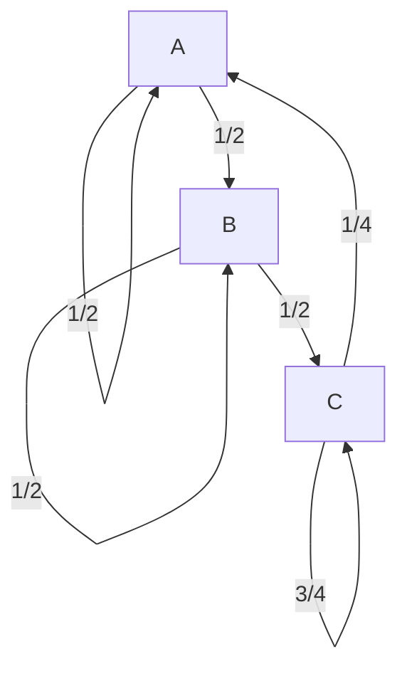

# 2019-10-3 WS 4.9
## 1. Determine whether $P$ is a regular stochastic matrix.
$$
P = \begin{bmatrix}
  .8 & 0 \\
  .2 & 1 \\
\end{bmatrix}
$$

**Solution:** No, items at B will stuck at B forever.

## 2. Consider the Markov chain below:

**Solution:**

$$
P = \begin{bmatrix}
  \frac12 & 0 & \frac14 \\
  \frac12 & \frac12 & 0 \\
  0 & \frac12 & \frac34 \\
\end{bmatrix}
$$

$$
\begin{aligned}
  (P - I)\vec x &= \vec0 \\
  \begin{bmatrix}
    -\frac12 & 0 & \frac14 \\
    \frac12 & -\frac12 & 0 \\
    0 & \frac12 & -\frac14
  \end{bmatrix}\vec x &= \vec0
\end{aligned}
$$

Observing the last row, we can guess $x_2 = 1$, $x_3 = 2$. Combined with the first row, we get $x_1 = 1$. Convert $\vec x$ to $\vec q$: $\begin{bmatrix} \frac14 \\ \frac14 \\ \frac12 \end{bmatrix}$.

## 3. Suppose there are two cities, X and Y. Every year,
- 70% of the people from X stay in X, the remaining 30% move to Y.
- 40% of the people from Y stay in Y, the remaining 60% move to X.

The initial population of X and Y are 100 and 200, respectively.

### a. What is the stochastic matrix that represents this situation?
$$
P = \begin{bmatrix}
  .7 & .6 \\
  .3 & .4 \\
\end{bmatrix}
$$

### b. After a long period of time, what is the population in city X?
$$
\begin{aligned}
  P &= \begin{bmatrix}
    .7 & .6 \\
    .3 & .4 \\
  \end{bmatrix} \\
  (P - I)\vec x &= \vec0 \\
  \begin{bmatrix}
    -.3 & .6 \\
    .3 & -.6 \\
  \end{bmatrix}\vec x & = \vec0 \\
  \vec x &= \begin{bmatrix} 6 \\ 3 \end{bmatrix} \\
  \vec q &= \begin{bmatrix} \frac23 \\ \frac13 \end{bmatrix} \\
  X &= (100 + 200)(\frac23) = 200
\end{aligned}
$$

## 4. Written Explanation Exercise: Let $P$ be a stochastic $n \times n$ matrix with positive entries. Give two methods of finding the steady-state solution.
**Solution:**

1. Solve for $(P - I)\vec x = \vec0$, then scale $\vec x$ to $\vec q$ with entries add up to 1.
2. Keep multiplying $P$ to itself and see what it converges to.

## 5. A mouse lives in a maze. At every hour it moves from the room where it stands to one of the adjacent rooms with equal probability. Design a mouse maze with transition matrix $P$. In the long run, is there a room that the mouse is more likely to be in at a given time? If so, which room?
$$
P = \frac12 \begin{bmatrix}
  1 & 1 & 0 & 0 \\
  0 & 1 & 1 & 0 \\
  0 & 0 & 1 & 1 \\
  1 & 0 & 0 & 1 \\
\end{bmatrix}
$$

**Solution:**

$$
\begin{aligned}
  (P - I)\vec x &= \vec0 \\
  \begin{bmatrix}
    -\frac12 & \frac12 & 0 & 0 \\
    0 & -\frac12 & \frac12 & 0 \\
    0 & 0 & -\frac12 & \frac12 \\
    \frac12 & 0 & 0 & -\frac12 \\
  \end{bmatrix}\vec x &= \vec0
\end{aligned}
$$

We notice $x_1 = x_2 = x_3 = x_4$. Convert to $\vec q$: $\vec q = \begin{bmatrix} \frac14 \\ \frac14 \\ \frac14 \\ \frac14 \end{bmatrix}$.