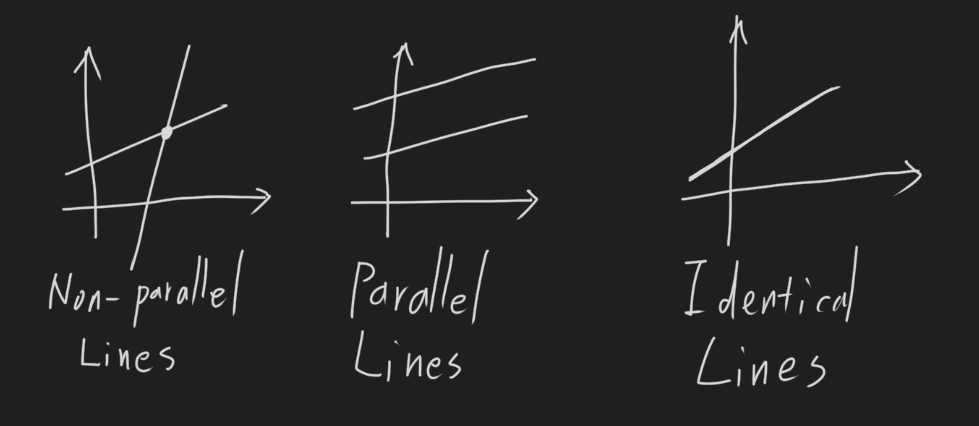
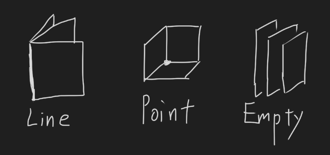

# 2019-8-19 1.1 Linear Equation & Linear System
## Linear Equation
$a_1x_1 + a_2x_2 + ... + a_nx_n  b$

$a_1$, $a_2$, ... , $a_n$ are `coefficients`.

$x_1$, $x_2$, ... , $x_n$ are `variables` (`unknowns`).

n is `dimension`.

n = 2 -> line
n = 3 -> plane

## Linear System
When there are more than one linear equations.

$$
\begin{alignedat}{4}
   x_1 & {}+{} & 1.5x_2 & {}+{} & \pi x_3 & = 4 \\
  5x_1 &       &        & {}+{} &    7x_3 & = 5 \\
\end{alignedat}
$$

## Two lines

## Three planes

## Row operation
1. Replacement/Addition: Add a mutiple of one row to another
2. Interchange: Switch two rows
3. Scaling: Multiply a row by a non-zero scalar

## Example
Given the following linear system:

$$
\begin{alignedat}{4}
   x_1 & {}-{} & 2x_2 & {}+{} &  x_3 & =  0 & (R_1) \\
       & {}+{} & 2x_2 & {}-{} & 8x_3 & =  8 & (R_2) \\
  5x_1 &       &      & {}-{} & 5x_3 & = 10 & (R_3) \\
\end{alignedat}
$$

Solve for unknowns.

### Solution

$$
R_1 \leftarrow R_1 + R_2
$$

$$
\begin{alignedat}{4}
   x_1 &       &      & {}-{} & 7x_3 & =  8 & (R_1) \\
       & {}+{} & 2x_2 & {}-{} & 8x_3 & =  8 & (R_2) \\
  5x_1 &       &      & {}-{} & 5x_3 & = 10 & (R_3) \\
\end{alignedat}
$$

$$
R_3 \leftarrow R_1 - \frac{R_3}{5}
$$

$$
\begin{alignedat}{4}
       &       &      & {}-{} & 6x_3 & =  8 & (R_1) \\
       & {}+{} & 2x_2 & {}-{} & 8x_3 & =  8 & (R_2) \\
  5x_1 &       &      & {}-{} & 5x_3 & = 10 & (R_3) \\
\end{alignedat}
$$

$$
\begin{aligned}
  x_1 &= 1 \\
  x_2 &= 0 \\
  x_3 &= -1
\end{aligned}
$$

## Definitions
A linear system is `consistent` if it has at least one **solution**.

Two matrices are `row equivalent` if a sequence of **row opwearions** transforms one matrix into the other.

## Fundamental Questions
1. Has solution? Consistent?
2. If it is consistent, is the solution unique?
