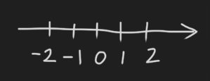
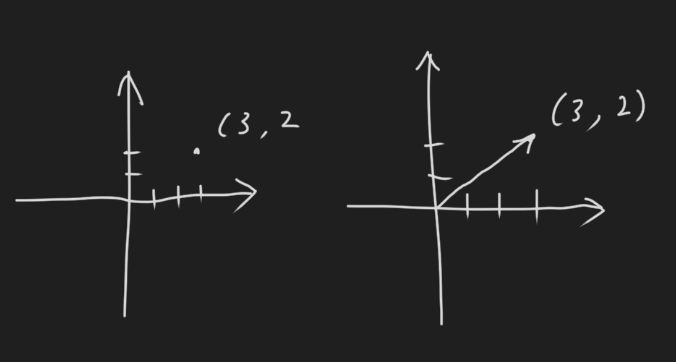
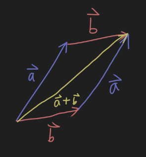
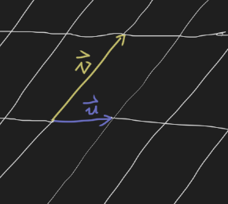
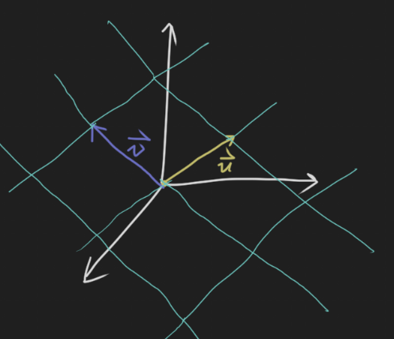

# 2019-8-23 1.3 Vector Equations
## $\mathbb{R} ^ n$
$\mathbb{R}$ is all real numbers

$\mathbb{R} ^ n$ is all ordered n-tuples of real number

When $n = 1$, we get a line:

When $n = 2$, we get a plane:

Point $(3, 2)$ and $\begin{pmatrix}3 \\ 2\end{pmatrix}$ are essentially the same thing.

## Vectors
Vectors start at origin and have lengths and directions. They are also matrices with 1 column.

### Vector Algebra
Suppose

$$
\vec{u} = \begin{pmatrix}u_1 \\ u_2\end{pmatrix}, \vec{v} = \begin{pmatrix}v_1 \\ v_2\end{pmatrix}
$$

#### Scalar Multiply
$$
c\vec{u} = \begin{pmatrix}cu_1 \\ cu_2\end{pmatrix}
$$

#### Vector Addition
$$
\vec{u} + \vec{v} = \begin{pmatrix}u_1 + v_1 \\ u_2 + v_2\end{pmatrix}
$$

### Parallelogram Rule for Vector Addition

## Linear Combinations
**Definition:** Given vectors $\vec{v_1}, \vec{v_2}, ... , \vec{v_p} \in \mathbb{R}^n$, and scalars $c_1, c_2, ... , c_3$, the vector below

$$
\vec{y} = c_1 \vec{v_1} + c_2 \vec{v_2} + ... + c_p \vec{v_p}
$$

is called a **linear combination** of $\vec{v_1}, \vec{v_2}, ... , \vec{v_p}$ **with weights** $c_1, c_2, ... , c_3$.

The set of all linear combinations of $\vec{v_1}, \vec{v_2}, ... , \vec{v_p}$ is called the **Span** of $\vec{v_1}, \vec{v_2}, ... , \vec{v_p}$.

### Plane
Any two vectors in $\mathbb{R} ^ 2$ that are not scalar multiples of each other, span $\mathbb{R} ^ 2$.

#### Example
Is $\vec{y}$ in the span of vectors $\vec{v_1}$ and $\vec{v_2}$?

$$
\vec{v_1} = \begin{pmatrix}1 \\ -2 \\ -3 \end{pmatrix}, \vec{v_2} = \begin{pmatrix}2 \\ 5 \\ 6 \end{pmatrix}, \vec{y} = \begin{pmatrix}7 \\ 4 \\ 15 \end{pmatrix}
$$

**Solution:** This question is essentially asking us to solve:

$$c_1 \vec{v_1} + x_2 \vec{v_2} = \vec{y}$$

Translate it to augmented matrix:

$$
\left[
\begin{array}{cc|c}
   1 & 2 &  7 \\
  -2 & 5 &  4 \\
  -3 & 6 & 15 \\
\end{array}
\right] \rightarrow \left[
\begin{array}{cc|c}
  1 &  2 &  7 \\
  0 &  9 & 18 \\
  0 & 12 & 36 \\
\end{array}
\right] \rightarrow \left[
\begin{array}{cc|c}
  1 & 2 & 7 \\
  0 & 1 & 2 \\
  0 & 1 & 3 \\
\end{array}
\right] \rightarrow \left[
\begin{array}{cc|c}
  1 & 2 &  7 \\
  0 & 1 &  2 \\
  0 & 0 & -1 \\
\end{array}
\right]
$$

The last row tells us the system is not consistent. Thus, $\vec{y}$ is not in the span of vectors $\vec{v_1}$ and $\vec{v_2}$.

Usually, 2 vectors that are in $\mathbb{R}^2$ gives a plane that passes through the origin. Any point not on such plane will not be in the span of these two vectors.

