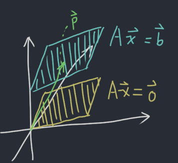

# 2019-8-26 1.5 Solution Sets of Linear System
$$
A \vec{x} = \vec{b}
$$

There are special choices for $\vec{b}$. Especially, when $\vec{b}$ is $\vec{0}$.

Linear systems of the form $A \vec{x} = \vec{0}$ are *homogeneous*. Otherwise, they are *inhomogeneous*.

Homogeneous linear systems always have the *trival solution* $\vec{x} = \vec{0}$

To determine whether they have $\infty$ solutions, we need to see if the augmented matrices have a column with no pivot (has free variables).

## Example
### Part 1
Identify the free variables and the solution set for

$$
\begin{alignedat}{3}
   x_1 & {}+{} & 3x_2 & {}+{} &  x_3 & = 0 \\
  2x_1 & {}-{} &  x_2 & {}-{} & 5x_3 & = 0 \\
   x_1 &       &      & {}-{} & 2x_3 & = 0 \\
\end{alignedat}
$$

**Solution:** Write it in the augmented matrix form:

$$
\left[\begin{array}{ccc|c}
  1 &  3 &  1 & 0 \\
  2 & -1 & -5 & 0 \\
  1 &    & -2 & 0 \\
\end{array}\right] \rightarrow \left[\begin{array}{ccc|c}
  1 & 0 & -2 & 0 \\
  0 & 1 &  1 & 0 \\
  0 & 0 &  0 & 0 \\
\end{array}\right] \rightarrow \begin{alignedat}{3}
   x_1 &       &     & {}-{} & 2x_3 & = 0 \\
       & {}+{} & x_2 & {}+{} &  x_3 & = 0 \\
\end{alignedat} \rightarrow \begin{alignedat}{1}
  x_1 & = 2x_3 \\
  x_2 & = -x_3 \\
\end{alignedat} \rightarrow \begin{bmatrix} 2x_3 \\ -x_3 \\ x_3 \end{bmatrix} = x_3 \begin{bmatrix} 2 \\ -1 \\ 1 \end{bmatrix}
$$

$x_3 \begin{bmatrix} 2 \\ -1 \\ 1 \end{bmatrix}$ is an explicit solution to the system. (Parametric form) This is also the **null solution**.

**null solution**: The solution to $A\vec{x} = \vec{0}$ (homogeneous solution).

### Part 2
Solve the system:

$$
\begin{alignedat}{3}
   x_1 & {}+{} & 3x_2 & {}+{} &  x_3 & =  9 \\
  2x_1 & {}-{} &  x_2 & {}-{} & 5x_3 & = 11 \\
   x_1 &       &      & {}-{} & 2x_3 & =  6 \\
\end{alignedat}
$$

**Solution:** Since we already know $x_3$ is free, we can choose any value for $x_3$. In this example, we will choose $x_3 = 0$.

Plug in $x_3 = 0$, we will get:

$$
\begin{alignedat}{1}
x_1 &= 6 \\
x_2 &= 1 \\
x_3 &= 0 \\
\end{alignedat}
$$

Thus, the solution to the system is:

$$
\vec{x} = \begin{bmatrix} 6 \\ 1 \\ 0 \end{bmatrix} + x_3 \begin{bmatrix} 2 \\ -1 \\ 1 \end{bmatrix}
$$

Free variable is $x_3$.

# Textbook Extras
## Parametric Vector Form
Example: Describe all solutions of $A\vec{x}=\vec{b}$ where

$$
A=\begin{bmatrix}
  3 & 5 & -4 \\
  -3 & -2 & 4 \\
  6 & 1 & -8 \\
\end{bmatrix},
\vec{b}=\begin{bmatrix} 7 \\ -1 \\ -4 \end{bmatrix}
$$

**Solution:** The augmented matrix reduces to

$$
\begin{bmatrix}
  1 & 0 & -\frac{4}{3} & -1 \\
  0 & 1 & 0 & 2 \\
  0 & 0 & 0 & 0 \\
\end{bmatrix}
$$

Which is equivelent of

$$
\begin{alignedat}{3}
   x_1 &       &     & {}-{} & \frac{4}{3}x_3 & = -1 \\
       & {}+{} & x_2 &       &                & = 2  \\
\end{alignedat} \rightarrow x_1 = -1 + \frac{4}{3} x_3, x_2 = 2
$$

$$
x=\begin{bmatrix} x_1 \\ x_2 \\ x_3 \end{bmatrix}
=\begin{bmatrix} -1 + \frac{4}{3} x_3 \\ 2 \\ x_3 \end{bmatrix}
=\begin{bmatrix} -1 \\ 2 \\ 0 \end{bmatrix}
+ x_3 \begin{bmatrix} \frac{4}{3} \\ 0 \\ 1 \end{bmatrix}
$$

## Theorem
Suppose the equation $A\vec{x}=\vec{b}$ is consistent for some given $\vec{b}$, and let $\vec{p}$ be a solution. Then the solution set of $A\vec{x}=\vec{b}$ is the set of all vectors of the form $\vec{w}=\vec{p}+\vec{v_h}$ where $\vec{v_h}$ is any solution of the homogeneous equation ${A\vec{x}=\vec{0}}$.

**Warning:** $A\vec{x}=\vec{b}$ choosen has to be consistent. That is, if it is possible to construct a conflicting system with $A$, you have to make sure $\vec{b}$ selected will not make the system inconsistent.