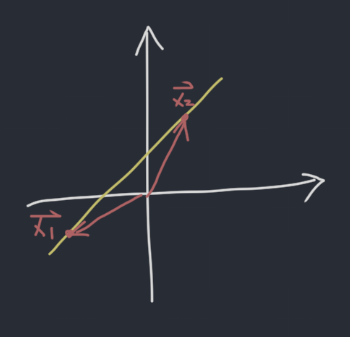

# 2019-8-27 WS 1.3 & 1.4
[WS1.3 and 1.4.pdf](_v_attachments/20190827082514839_7012/WS1.3%20and%201.4.pdf)
## 1. Written Explanation Exercise
### a. What does the span of a set of vectors represent?
**Solution:** It represents all linear combinations of these vectors.

### b. Hoe do we determine whether a vector is in the span of a set of vector?
**Solution:** Convert it to augmented matrix form and reduce it. If it is consistent, then the vector is in the span of the set of vectors. Otherwise not.

### c. Let $b$ be a nonzero vector. Is it true that every linear combination of two solutions of $A\vec{x}=b$ is a solution of $A\vec{x}=b$? If yes, why. If no, give a counter example.
**Solution:** For example, given the following augmented matrix:

$$
\left[\begin{array}{cc|c}1 & 2 & 3\end{array}\right]
$$

The solution to the system may be $\begin{bmatrix}1 \\ 1\end{bmatrix}$ or $\begin{bmatrix}3 \\ 0\end{bmatrix}$. However, one of the linear combination of these two vectors is $\begin{bmatrix}4 \\ 1\end{bmatrix}$, which is not a solution to the system.

Graphically,

$\vec{x_1}$ and $\vec{x_2}$ span the entire plane, which is not the same as the solution (line).

## 2. Indicate whether the statements are true or false
### a. If the equation $A\vec{x}=b$ is inconsistent, then $\vec{b}$ is not in the set spanned by the columns of $A$.
**Solution:** True, that is how you determine whether a vector is in the span of a set of vectors.

### b. If the augmented matrix $\begin{bmatrix}A & \vec{b}\end{bmatrix}$ has a pivot position in every row, then the equation $A\vec{x}=\vec{b}$ must be consistent.
**Solution:** False, because if the last column of the matrix contains a pivot, the equation is not consistent.

### c. There are exactly three vectors in $Span\{\vec{a_1},\vec{a_2},\vec{a_3}\}$.
**Solution:** False. All linear combinations of these vetors are in the span.

## 3. $Span\{\vec{v_1},\vec{v_2}\}$ is equal to which of the expressions below?
i) $Span\{\vec{v_1},\vec{v_2},3\vec{v_1}\}$

ii) $Span\{\vec{v_1},3\vec{v_1}\}$

iii) $Span\{\vec{v_1},\vec{v_2},3\vec{v_1}+2\vec{v_2}\}$

**Solution:** i and iii are equivelent. to $Span\{\vec{v_1},\vec{v_2}\}$.
## 4. For what values of $h$ is $\vec{b}$ in the plane spanned by $\vec{a_1}$ and $\vec{a_2}$?

$$
\vec{a_1} = \begin{bmatrix}1 \\ 4 \\ -1\end{bmatrix},
\vec{a_2} = \begin{bmatrix}-6 \\ -17 \\ 2\end{bmatrix},
\vec{a_3} = \begin{bmatrix}4 \\ 2 \\ h\end{bmatrix}
$$

The following system must be consistent:

$$
\left[\begin{array}{cc|c}
1 & -6 & 4 \\
4 & -17 & 2 \\
-1 & 2 & h \\
\end{array}\right] \rightarrow \left[\begin{array}{cc|c}
1 & -6 & 4 \\
0 & 7 & -14 \\
0 & -4 & h + 4 \\
\end{array}\right] \rightarrow \left[\begin{array}{cc|c}
1 & -6 & 4 \\
0 & 1 & -2 \\
0 & 1 & -\frac{h}{4} - 1 \\
\end{array}\right] \rightarrow \left[\begin{array}{cc|c}
1 & -6 & 4 \\
0 & 1 & -2 \\
0 & 0 & -\frac{h}{4} + 1 \\
\end{array}\right]
$$

This has to be consistent so the last row have to be all zeros. Thus $\frac{h}{4} = 1$, $h = 4$.