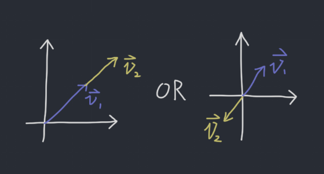
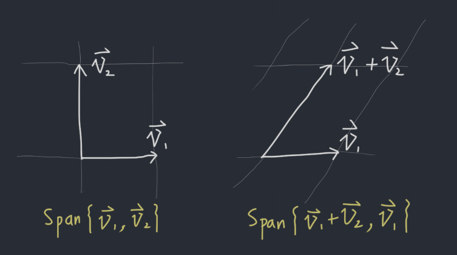
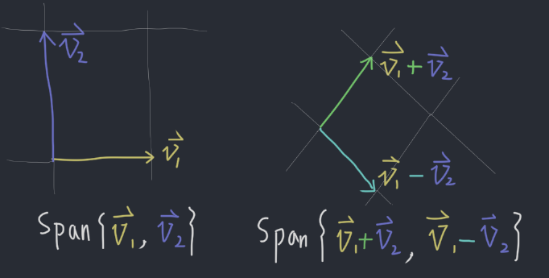

# 2019-8-28 1.7 Linear Independence
A set of vectors $\{\vec{v_1}, \vec{v_2}, ... , \vec{v_k}\}$ in $\mathbb{R}^n$ are *linearly independent* if $c_1\vec{v_1} + c_2\vec{v_2} + ... + c_k\vec{v_k} = \vec{0}$ ($A\vec{c} = \vec{0}$) has only the trivial solution. It is *linearly dependent* otherwise. (The homogeneous form only contains the orgin as its solution.)

To determine whether a set is *linear independent*, we need to solve $A\vec{x} = \vec{0}$.

- If there is a non-zero solution $\vec{x}$, it is linear dependent.
- If there is only zero solution $\vec{x}$, it is linear independent.  

> The columns of A are linearly dependent if and only if there is a free variable in an Echelon form of A.

## Example
For what values of $h$ are the vectors linearly independent.

$$
\begin{bmatrix} 1 \\ 1 \\ h \end{bmatrix}, \begin{bmatrix} 1 \\ h \\ 1 \end{bmatrix}, \begin{bmatrix} h \\ 1 \\ 1 \end{bmatrix}
$$

**Solution:** Write it as a matrix:

$$
\begin{bmatrix}
1 & 1 & h \\
1 & h & 1 \\
h & 1 & 1 \\
\end{bmatrix} \rightarrow \begin{bmatrix}
1 & 1 & h \\
0 & h - 1 & 1 - h \\
0 & 1 - h & 1 - h^2 \\
\end{bmatrix} \rightarrow \begin{bmatrix}
1 & 1 & h \\
0 & h - 1 & 1 - h \\
0 & 0 & 2 - h^2 - h \\
\end{bmatrix}
$$

We want it to have free variables.

> In the square case, there is a free variable in an Echelon form of A if and only if the RREF has a row of all zeros.

- Case 1, the second row is all zeros, we get $h = 1$.
- Case 2, the third row is all zeros, we solve $2 - h^2 - h = 0$, and get $h = 1$ or $h = -2$.

Thus, the system is independent if $h \neq 1$ and $h \neq -2$.

## One Vector
Suppose $\vec{v} \in \mathbb{R}^n$, when is the set $\{\vec{v}\}$ linearly dependent?

**Solution:** $\vec{v} = \vec{0}$.

## Two Vectors
Suppose $\vec{v_1}, \vec{v_2} \in \mathbb{R}^n$, when is the set $\{\vec{v_1}, \vec{v_2}\}$ linearly dependent, provide a geometric interpretation.

**Solution:** When they are scalar multiple of each other.

## Two Theorems
See textbook extras.

# Textbook Extras
## A series of vectors are linearly dependent if and only if one of the vector is the linear combination of the rest. 
**To be more specific**, they are linearly dependent if any of those vectors is a linear combination of vectores preceeding it. (Except $\vec{v_1} = \vec{0}$, in which case, the system is already linearly dependent.)

For example,

$$
\begin{bmatrix} 1 \\ 2 \\ 3 \end{bmatrix}, \begin{bmatrix} 3 \\ 6 \\ 9 \end{bmatrix}
$$

are linear depedent because you can get the second by multiplying the first one by 2.

Some explanations: in the above example, the $x_2$ can always be replaced by $3x_1$. Then once you find a solution (for example, the trival one), you can always change $x_2$ to whatever you want.

## If a set has more rows than columns, the matrix is linear dependent.
For example,

$$
\begin{bmatrix}
  1 & 2 & 3 & 4 & 5  \\
  6 & 7 & 8 & 9 & 10 \\
\end{bmatrix}
$$

is definitely linear dependent.

## If a row only contains 0, the matrix is linear dependent.
For example,

$$
\begin{bmatrix}
  1 & 2 & 3 \\
  0 & 0 & 0 \\
  7 & 8 & 9 \\
\end{bmatrix}
$$

is linear dependent

# Lecture Extras
$\vec{v_1}, \vec{v_2}, \dots, \vec{v_n}$ are linearly dependent if and if only if the solution of $c_1\vec{v_1}, c_2\vec{v_2}, \dots, c_n\vec{v_n} = 0$ is $c_1, c_2, \dots, c_n = 0$.

## Example 1
Any 4 vectors in $\mathbb{R}^3$ are linearly **dependent**, why?

**Solution:** To determine whether it is linearly dependent, we write:

$$
c_1\vec{v_1} + c_2\vec{v_2} + c_3\vec{v_3} + c_4\vec{v_4} = 0
$$

We have coefficient matrix:

$$
\begin{bmatrix}
  \vec{v_1} & \vec{v_2} & \vec{v_3} & \vec{v_4}
\end{bmatrix}
$$

The matrix is short tall (3 rows, 4 columns), thus it must be linearly dependent.

## Example 2
For which $h$, are these the columns of the following matrix linearly dependent?

$$
\begin{bmatrix}
  1 & 0 & h \\
  0 & h & 1 \\
  h & 1 & 0 \\
\end{bmatrix}
$$

**Solution:** First row reduce it.

$$
\begin{bmatrix}
  1 & 0 & h \\
  0 & h & 1 \\
  h & 1 & 0 \\
\end{bmatrix} \rightarrow \begin{bmatrix}
  1 & 0 & h \\
  0 & h & 1 \\
  0 & 1 & -h^2 \\
\end{bmatrix} \rightarrow \begin{bmatrix}
  1 & 0 & h \\
  0 & 0 & 1+h^3 \\
  0 & 1 & -h^2 \\
\end{bmatrix}
$$

In order for it to be linearly dependent, there has to be a free variable. The only way for this system to have a free variable is to have the second row to be all zeros. Hence,

$$
1 + h^3 = 0 \rightarrow h = -1
$$

Thus, the columns of the matrix are linearly dependent if $h \neq -1$.

## Example 3
Given $\vec{v_1}$ and $\vec{v_2}$ are linearly independent, is $Span\{\vec{v_1}, \vec{v_2}\}$ the same as $Span\{\vec{v_1} + \vec{v_2}, \vec{v_1}\}$?

**Solution:** Yes

## Example 4
Given $\vec{v_1}$ and $\vec{v_2}$ are linearly independent, is $Span\{\vec{v_1}, \vec{v_2}\}$ the same as $Span\{\vec{v_1} + \vec{v_2}, \vec{v_1} - \vec{v_2}\}$?

**Solution:** Yes

