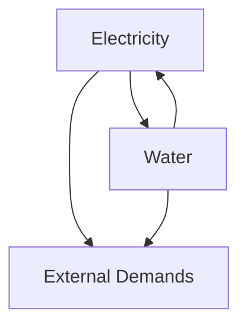
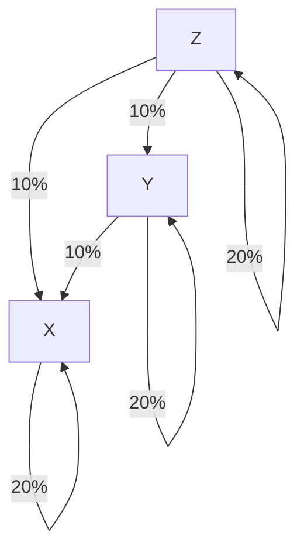
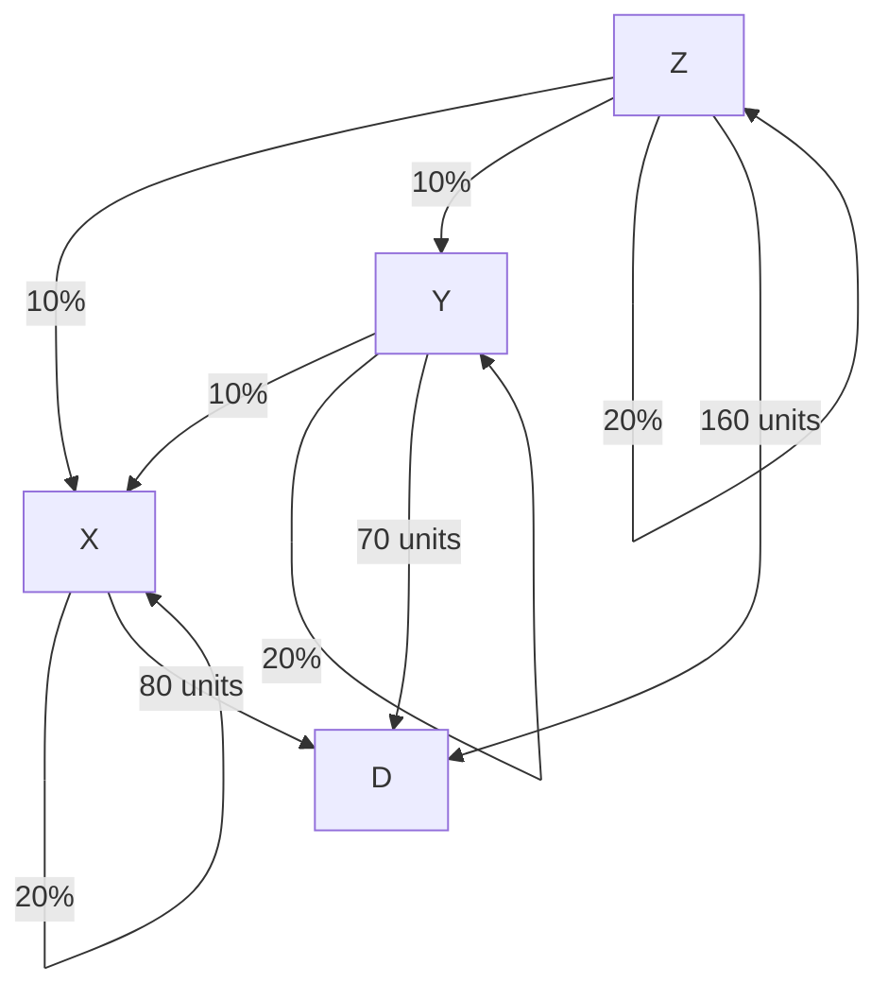

# 2019-9-20 2.6 The Leontif Input-Output Model
Used to model interconnected systems:

This economy contains two sectors:

1. Electricity
2. Water

To produce one, the other is required. There is also this External Demands, which doesn't produce anything but require electricity and water.

We can model things like this with Leontif Model

## The Leontif Model
Suppose an economy has $N$ sectors, with outputs measured by $\vec{x} \in \mathbb{R}^N$. The $j^{th}$ sector needs some number of units of the $i^{th}$ sector to produce a unit of its good, call that $C_{i,j}$.

$$
\begin{aligned}
  \vec{x} &= \text{output} \\
  C \vec{x} &= \text{units consumed} \\
  \vec{x} - C\vec{x} &= \text{unites left after internal consumption}
\end{aligned}
$$

$C$ is the **consumption matrix**, each element of $C$ is between $0$ and $1$.

There is also an external demand given by $\vec{d} \in \mathbb{R}^N$. We ask if there is an $\vec{x}$ such that

$$
\vec{x} - C\vec{x} = \vec{d}
$$

Solving for $\vec{x}$ yields

$$
\vec{x} = (I - C)^{-1} \vec{d}
$$

This is the **Leontief Input-Output Model**.

### Example
An economy contains sectors X, Y, Z. For every 100 unit of output,

- X requires 20 units from X, 10 units from Y, and 10 units from Z.
- Y requires 0 units from X, 20 units from Y, and 10 units from Z.
- Z requires 0 units from X, 0 units from Y, and 20 units from Z.

**Solution:** Our consumption matrix is:

$$
C = \begin{bmatrix}
  0.2 & 0 & 0 \\
  0.1 & 0.2 & 0 \\
  0.1 & 0.1 & 0.2 \\
\end{bmatrix}
$$

Note:

- Total output for each sector is the sum along the outgoing edges for each sector, which generates rows of $C$.
- Elements of $C$ represent percentages with no units, they have values between 0 and 1.
- Output vector and demand vector have units

### Example, continued
Now suppose there is an external demand: what production is required to satisfy a final demand of 80 units of X, 70 units of Y, and 160 units of Z?

**Solution:** The production level would be found by solving:

$$
\begin{aligned}
  \vec{x} - C \vec{x} &= \vec{d} \\
  (I - C) \vec{x} &= \vec{d} \\
  \begin{bmatrix}
    0.8 & 0 & 0 \\
    -0.1 & 0.8 & 0 \\
    -0.1 & -0.1 & 0.8 \\
  \end{bmatrix} \vec{x} &= \begin{bmatrix}
    80 \\ 70 \\ 160
  \end{bmatrix} \\
  0.8 x_1 &= 80 & \rightarrow x_1 &= 100 \\
  -0.1 x_1 + 0.8 x_2 &= 70 & \rightarrow x_2 &= 100 \\
  -0.1 x_1 - 0.2 x_2 + 0.8 x_3 &= 160 & \rightarrow x_3 &= \frac{180}{0.8} = 225 \\
\end{aligned}
$$

The output that balances demand with internal consumption is

$$
\begin{bmatrix}
  100 \\ 100 \\ 225
\end{bmatrix}
$$

## The Importance of $(I - C)^{-1}$
First, $(I - C)^{-1}$ is kinda of easy to approximate.

### Easy to approximate?
We all know $1 + r + r^2 + r^3 + \dots = \frac{1}{1-r}$ for $0 < r < 1$.

Why it works:

$$
\begin{aligned}
(1 + r + r^2 + r^3 + \dots)(1 - r) &= \frac{1}{1 - r} (1 - r) \\
(1 + r + r^2 + r^3 + \dots) - (r + r^2 + r^3 + r^4 \dots) &= 1 \\
1 &= 1 \\
\end{aligned}
$$

It turned out, it worked for matrices too!

For matrices with all items $0 \le c < 1$, $\lim_{n \to \infty} C^n \to 0$.

Thus, $(I - C)^{-1}$ can be approximated by $I + C + C^2 + C^3 + \dots$.

### Now what?
The entries of $(1 - C)^{-1} = B$ have this meaning: if the final demand vector $\vec{d}$ increases by one unit in the $j^{th}$ place, the column vector $b_j$ is the additional output required from all sectors.

For the example above:

$$
(I - C)^{-1} = \begin{bmatrix}
  1.25 & 0 & 0 \\
  0.15 & 1.25 & 0 \\
  0.18 & 0.17 & 1.25 \\
\end{bmatrix}
$$

So to meet and increase in demand for Z by one unit, increase of 1.25 units of Z is required.

Also, to meet and increase in demand for X by one unit, increase of 1.25 units of X, 0.15 units of Y, and 0.18 units of Z is required.