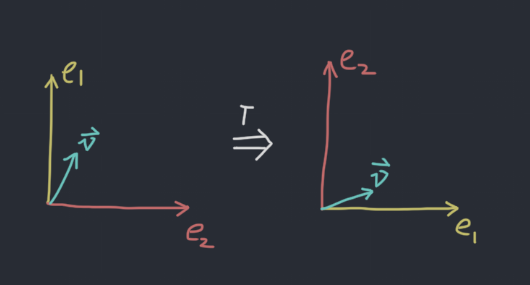
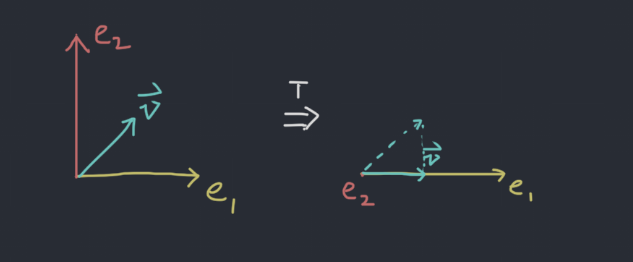
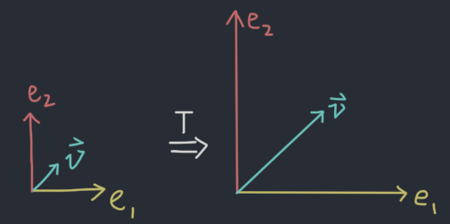
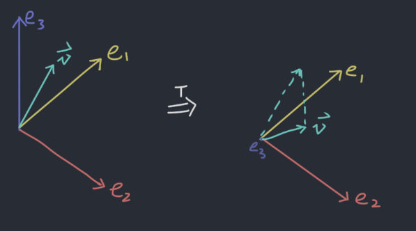
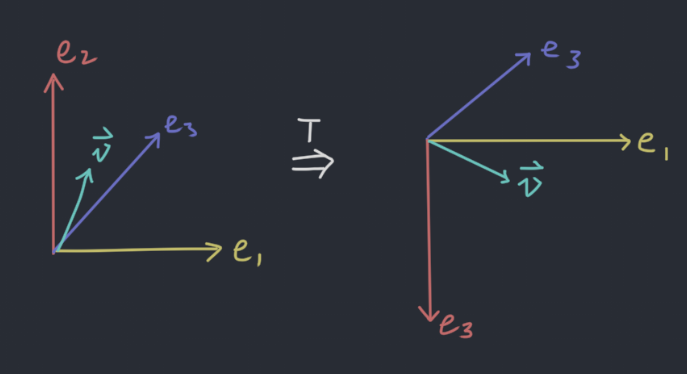

# 2019-9-4 1.8 Linear Transformation
$$
T(\vec{v}) = A\vec{v}
$$

where T is a function that transforms from $\mathbb{R}^n$ to $\mathbb{R}^m$. $\mathbb{R}^n$ is the **domain**, while $\mathbb{R}^m$ is the **co-domain** or **target**.

$T(\vec{x})$ is called the **image** of $\vec{x}$ under $T$.

The set of all possible images $T(\vec{x})$ is the range of $T$.

A $m \times n$ matrix transforms from $\mathbb{R}^n$ to $\mathbb{R}^m$.

## Example 1
Let $A = \begin{bmatrix} 1 & 1 \\ 0 & 1 \\ 1 & 1 \end{bmatrix}, \vec{u} = \begin{bmatrix} 3 \\ 4 \end{bmatrix}, \vec{b} = \begin{bmatrix} 7 \\ 5 \\ 7 \end{bmatrix}$, answer the following question.

**Not really solution but solution:** Since $A$ is a tall and thin matrix, $A$ will transform from lower dimension to higher dimension. Also, since there are only 2 pivots in $A$, whatever is resulted from the transformation will only be a plane in 3 dimension.

### 1. Compute $T(\vec{u})$
**Solution:**

$$
T(\vec{u}) = \begin{bmatrix} 1 & 1 \\ 0 & 1 \\ 1 & 1 \end{bmatrix}\begin{bmatrix} 3 \\ 4 \end{bmatrix} = \begin{bmatrix} 3 + 4 \\ 4 \\ 3 + 4 \end{bmatrix} = \begin{bmatrix} 7 \\ 4 \\ 7 \end{bmatrix}
$$

### 2. Calculate $\vec{v} \in \mathbb{R}^2$ so that $T(\vec{v}) = \vec{b}$
**Solution:**

$$
T(\vec{v}) = \begin{bmatrix} 1 & 1 \\ 0 & 1 \\ 1 & 1 \end{bmatrix}\begin{bmatrix} x_1 \\ x_2 \end{bmatrix} = \begin{bmatrix} 7 \\ 5 \\ 7 \end{bmatrix}
$$

By looking at the middle row, we know $x_2 = 5$, then we can solve for $x_1$, which is 2. Thus $\vec{v} = \begin{bmatrix} 2 \\ 5 \end{bmatrix}$.

If the situation is more complicated, row reduction may be required.

### 3. Give a $\vec{c} \in \mathbb{R}^3$ so there is no $\vec{v}$ with $T(\vec{v}) = \vec{c}$
This question is equivelent of the following to statements:

- Give a $\vec{c}$ that is not in the range of $T$.
- Give a $\vec{c}$ that is not in the span of columns of $A$.

**Solution:**

$$
\left[\begin{array}{cc|c}
  1 & 1 & c_1 \\
  0 & 1 & c_2 \\
  1 & 1 & c_3 \\
\end{array}\right] \rightarrow \left[\begin{array}{cc|c}
  1 & 1 & c_1 \\
  0 & 1 & c_2 \\
  0 & 0 & c_3 - c_1 \\
\end{array}\right]
$$

To make it inconsistent, we just need to create a conflict. As long as $c_3 \neq c_1$, the equation will not have solution. A example solution might be $\begin{bmatrix} 1 \\ 0 \\ 0 \end{bmatrix}$.

## Determine whether a function is linear
A function $T$ that transforms from $\mathbb{R}^n$ to $\mathbb{R}^m$ is linear if

- $T(\vec{u} + \vec{v}) = T(\vec{u}) + T(\vec{v})$ for all $\vec{u}, \vec{v}$ in $\mathbb{R}^n$
- $T(c\vec{v}) = cT(\vec{v})$ for all $\vec{v} \in \mathbb{R}^n$ and $c \in \mathbb{R}$.

Every matrix transformation is linear transformation

## Example 2
What does the following do:

### 1. $A = \begin{bmatrix} 0 & 1 \\ 1 & 0 \end{bmatrix}$
**Solution:** It flips the x-axis ($e_1$) and the y-axis ($e_2$).

### 2. $A = \begin{bmatrix} 1 & 0 \\ 0 & 0 \end{bmatrix}$
**Solution:** It projects the vector to $e_1$.

### 3. $A = \begin{bmatrix} k & 0 \\ 0 & k \end{bmatrix}$
**Solution:** It dilutes the space by $k$.

### 4. $A = \begin{bmatrix} 1 & 0 & 0 \\ 0 & 1 & 0 \\ 0 & 0 & 0 \end{bmatrix}$
**Solution:** It projects the vector to the x-y plane ($e_1$ - $e_2$ plane).

### 5. $A = \begin{bmatrix} 1 & 0 & 0 \\ 0 & -1 & 0 \\ 0 & 0 & 1 \end{bmatrix}$
**Solution:** It flips the sign of y ($e_2$) axis.

## Example 3
If $T(\begin{bmatrix} 1 \\ 0 \end{bmatrix}) = \begin{bmatrix} 5 \\ -7 \\ 2 \end{bmatrix}$ and $T(\begin{bmatrix} 0 \\ 1 \end{bmatrix}) = \begin{bmatrix} -3 \\ 8 \\ 0 \end{bmatrix}$, find tranform matrix $A$.

**Solution:** $\begin{bmatrix} 1 \\ 0 \\ 0 \\ \vdots \\ 0 \end{bmatrix}$ extracts the first column of a matrix, and $\begin{bmatrix} 0 \\ 1 \\ 0 \\ \vdots \\ 0 \end{bmatrix}$ extracts the second column. Thus, the first column of $A$ is $\begin{bmatrix} 5 \\ -7 \\ 2 \end{bmatrix}$ and the second column is $\begin{bmatrix} -3 \\ 8 \\ 0 \end{bmatrix}$. Therefore,

$$
A = \begin{bmatrix}
   5 & -3 \\
  -7 &  8 \\
   2 &  0 \\
\end{bmatrix}
$$

# Textbook Extras
Linear transformation $A$ acted upon $\vec{x}$ is denoted as $\vec{x} \mapsto A\vec{x}$

Matrix transformation is a type of linear transformation. There are other types of linear transformation.

The combined property of linear transformation is:

$$
T(c_1\vec{v_1} + c_2\vec{v_2} + \dots + c_n\vec{v_n}) = c_1T(\vec{v_1}) + c_2T(\vec{v_2}) + \dots + c_nT(\vec{v_n})
$$

Matrices that statisfy $T(\vec{x})=r\vec{x}$ is called contraction if $0 \leq r \leq 1$ or dilation if $1 < r$.
