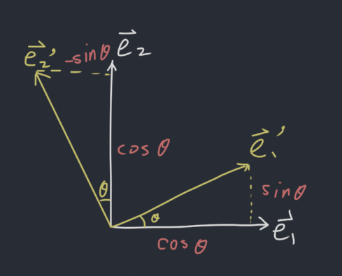

# 2019-9-6 1.9 Linear Transformation+
## Standard Vectors
$$
\vec{e_1} = \begin{bmatrix}
  1 \\ 0 \\ 0 \\ 0 \\ 0 \\ \vdots
\end{bmatrix}, \vec{e_2} = \begin{bmatrix}
  0 \\ 1 \\ 0 \\ 0 \\ 0 \\ \vdots
\end{bmatrix}, \vec{e_3} = \begin{bmatrix}
  0 \\ 0 \\ 1 \\ 0 \\ 0 \\ \vdots
\end{bmatrix}
$$

They are context specific.

For example, in $\mathbb{R}^3$,

$$
\vec{e_1} = \begin{bmatrix}
  1 \\ 0 \\ 0
\end{bmatrix}, \vec{e_2} = \begin{bmatrix}
  0 \\ 1 \\ 0
\end{bmatrix}, \vec{e_3} = \begin{bmatrix}
  0 \\ 0 \\ 1
\end{bmatrix}
$$

## Property of Standard Vectors
They can extract a column of a matrix.

Multiplying a matrix by $\vec{e_j}$, gives the $j$th column of $A$.

For example, $A\vec{e_3}$ gives the 3rd column of $A$.

### Example
What is

$$
\begin{bmatrix}
  1 & 2 & 3 \\
  4 & 5 & 6 \\
  7 & 8 & 9 \\
\end{bmatrix}\vec{e_2}
$$

**Solution:** $\vec{e_2}$ extracts the second column, so the answer is $\begin{bmatrix} 2 \\ 5 \\ 8 \end{bmatrix}$.

## Standard Matrix
> Theorem are universally true and have some significance

Let $T:\mathbb{R}^n \mapsto \mathbb{R}^m$ be a linear transformation, then there is a unique matrix $A$ such that

$$
T(\vec{x}) = A\vec{x}, \vec{x} \in \mathbb{R}^n
$$

In fact $A$ is $m \times n$ and its $j$th column is the vector $T(\vec{e_j})$.

$$
A = \begin{bmatrix}
  T(\vec{e_1}) & T(\vec{e_2}) & \dots & T(\vec{e_n})
\end{bmatrix}
$$

### Example
What is the linear transformation $T:\mathbb{R}^2 \mapsto \mathbb{R}^3$ defined by $T(\vec{x}) = \vec{x} \text{ rotated clock wise by angle } \theta$?

**Solution:** We can start simple.

When $\theta = 0$, there is no rotation, so it is just the identity matrix: $\begin{bmatrix} 1 & 0 \\ 0 & 1 \end{bmatrix}$.

When $\theta = \frac{\pi}{2}$, we can use $\begin{bmatrix} 0 & -1 \\ 1 & 0 \end{bmatrix}$.

Otherwise, we will use some trigonometric function: $\begin{bmatrix} \cos\theta & -\sin\theta \\ \sin\theta & \cos\theta \end{bmatrix}$.

Also, we learned that a rotation about origin is a linear transformation.

## Some Simple Transformation
- Reflection through $e_1$: $\begin{bmatrix} 1 & 0 \\ 0 & -1 \end{bmatrix}$
- Reflection through $e_2$: $\begin{bmatrix} -1 & 0 \\ 0 & 1 \end{bmatrix}$
- Reflection through $e_1 = e_2$: $\begin{bmatrix} 0 & 1 \\ 1 & 0 \end{bmatrix}$
- Reflection through $e_1 = -e_2$: $\begin{bmatrix} 0 & -1 \\ -1 & 0 \end{bmatrix}$
- Horizontal contraction / expansion: $\begin{bmatrix} k & 0 \\ 0 & 1 \end{bmatrix}$ ($\left|k\right| < 1$ is contraction, $k > 1$ is expansion)
- Vertical contraction / expansion: $\begin{bmatrix} 1 & 0 \\ 0 & k \end{bmatrix}$ ($\left|k\right| < 1$ is contraction, $k > 1$ is expansion)
- Horizontal shear: $\begin{bmatrix} 1 & k \\ 0 & 1 \end{bmatrix}$ ($k < 1$ is to left, $k > 1$ is to right)
- Vertical shear: $\begin{bmatrix} 1 & 0 \\ k & 1 \end{bmatrix}$ ($k < 1$ is to bottom, $k > 1$ is to top)
- Projection to $e_1$: $\begin{bmatrix} 1 & 0 \\ 0 & 0 \end{bmatrix}$
- Projection to $e_2$: $\begin{bmatrix} 0 & 0 \\ 0 & 1 \end{bmatrix}$

## Onto (French: *Sarjective*)
$T:\mathbb{R}^n \mapsto \mathbb{R}^m$ is onto if for all $\vec{b} \in \mathbb{R}^m$ there is a $\vec{x} \in \mathbb{R}^n$ so that $T(\vec{x}) = \vec{b}$.

Onto is an **existence property**. For any $\vec{b} \in \mathbb{R}^m$, $A\vec{x} = \vec{b}$ has a solution.

### Example
- Rotation is an onto transformation.
- Projection is not an onto transformation.

### Useful ☆ Facts
$T$ is onto if and only if every row has a pivot it $T$'s standard matrix. This statement is equivalent of the columns span $\mathbb{R}^m$.

## One-to-one (French: *Injective*)
$T:\mathbb{R}^n \mapsto \mathbb{R}^m$ is one-to-one if and only if for all $\vec{b} \in \mathbb{R}^m$, there is at most one (possibly none) $\vec{x} \in \mathbb{R}^n$ so that $T(\vec{x}) = \vec{b}$.

### Example
- Rotation is a one-to-one transformation
- Projection is not a one-to-one transformation

### Useful ☆ Facts
$T$ is one-to-one if the only solution to $T(\vec{x}) = \vec{0}$ is the zero vector ($\vec{x} = \vec{0}$). This statement is equivalent of the following:

- Standard matrix does not have free variable
- Every column has a pivot
- Columns are independent

## Example
Complete the matrices below by entering numbers intp the missing entries so that the properties are satisified. If it is not possible to do so, state why.

### a. $A$ is a $2 \times 3$ standard matrix for a one-to-one linear transformation.
$$
A = \begin{bmatrix}
  1 & 0 & ? \\
  0 & ? & 1 \\
\end{bmatrix}
$$

**Solution:** It is not possible because one-to-one means every column has a pivot, which is not possible in a "short fat" matrix.

### b. $B$ is a $3 \times 2$ standard matrix for an onto linear transformation.
$$
A = \begin{bmatrix}
  1 & ? \\
  ? & ? \\
  ? & ? \\
\end{bmatrix}
$$

**Solution:** It is not possible because onto means every row has a pivot, which is not possible in a "tall thin" matrix.

### c. $C$ is a $3 \times 3$ standard matrix for a linear transformation that is one-to-one and onto.
$$
A = \begin{bmatrix}
  1 & 1 & 1 \\
  ? & ? & ? \\
  ? & ? & ? \\
\end{bmatrix}
$$

**Solution:** We only need to make every column and every row have pivots. For example, we can do:

$$
A = \begin{bmatrix}
  1 & 1 & 1 \\
  0 & 1 & 0 \\
  0 & 0 & 1 \\
\end{bmatrix}
$$
