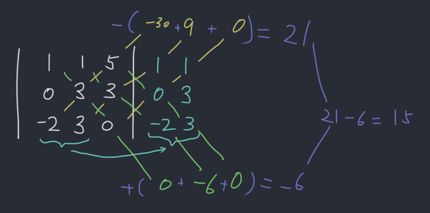
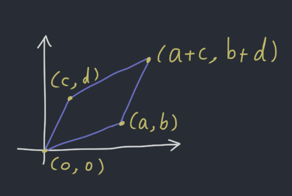
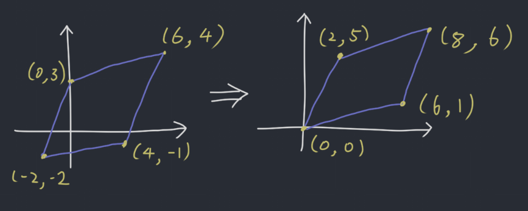
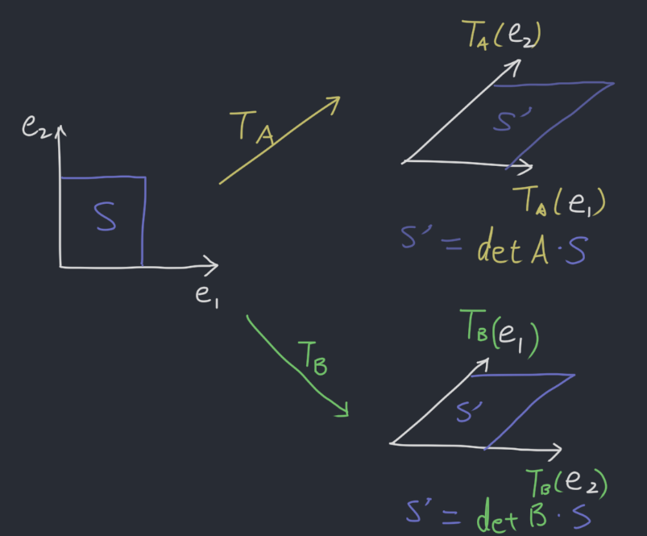

# 3.1-3.3 Determinants
Lectured on 9/27/2019, 9/30/2019

Determinants only apply to square matrices. They are hard to calculate but triangular matrices' determinants are much easier to calculate.

$A$ is $n \times n$ and has elements $a_{ij}$

- If $n = 1$, $A = [a_{11}]$, $\det A = a_{11}$
- Inductive case: $n \gt 1$, $\det A = a_{11} \det A_{11} - a_{12} \det A_{12} + a_{13} \det A_{13} - \dots + (-1)^{1 + n}a_{1n} \det A_{1n}$ where $A_{ij}$ is the submstrix obtained by eliminating row $i$ and column $j$ of $A$.

## Example 1
Compute $\det \begin{bmatrix} a & b \\ c & d \end{bmatrix} = \begin{vmatrix} a & b \\ c & d \end{vmatrix}$.

**Solution:**

$$
\begin{aligned}
    &\begin{vmatrix} a & b \\ c & d \end{vmatrix} \\
  = &a \det \begin{bmatrix} d \end{bmatrix} - b \det \begin{bmatrix} c \end{bmatrix} \\
  = & ad - bc
\end{aligned}
$$

## Example 2
Compute $\det \begin{bmatrix} 1 & -5 & 0 \\ 2 & 4 & -1 \\ 0 & 2 & 0 \end{bmatrix}$

**Solution:**

$$
\begin{aligned}
    & \det \begin{bmatrix} 1 & -5 & 0 \\ 2 & 4 & -1 \\ 0 & 2 & 0 \end{bmatrix} \\
  = &      1 \cdot \det \begin{bmatrix} 4 & -1 \\ 2 & 0 \end{bmatrix}
      - (-5) \cdot \det \begin{bmatrix} 2 & -1 \\ 0 & 0 \end{bmatrix}
      +  (0) \cdot \det \begin{bmatrix} 2 &  4 \\ 0 & 2 \end{bmatrix} \\
  = & 2 + 0 + 0 \\
  = & 2
\end{aligned}
$$

## Cofactor
Cofactor of an $n \times n$ matrix $A$, $C_{ij}$ is:

$$
C_{ij} = (-1)^{i + j} \det A_{ij}
$$

The sign pattern goes like this:

$$
\begin{bmatrix}
  + & - & + & - & \dots \\
  - & + & - & + & \dots \\
  + & - & + & - & \dots \\
  - & + & - & + & \dots \\
  \vdots & \vdots & \vdots & \vdots & \ddots \\
\end{bmatrix}
$$

The determinant of a matrix $A$ can be computed down any row or column of the matrix. For instance down the $j$th column, the determinant is:

$$
\det A = a_{1j} C_{1j} + a_{2j} C_{2j} + \dots + a_{nj}C_{nj}
$$

### Example 3
Compute $\det \begin{bmatrix} 5 & 4 & 3 & 2 \\ 0 & 1 & 2 & 0 \\ 0 & -1 & 1 & 0 \\ 0 & 1 & 1 & 3 \end{bmatrix} = \det A$

**Solution:**

First, expand across the first column

$$
\det A = 5 \det \begin{bmatrix} 1 & 2 & 0 \\ -1 & 1 & 0 \\ 1 & 1 & 3 \end{bmatrix}
$$

Then expand across the third column

$$
\det \begin{bmatrix} 1 & 2 & 0 \\ -1 & 1 & 0 \\ 1 & 1 & 3 \end{bmatrix} = 3 \det \begin{bmatrix} 1 & 2 \\ -1 & 1 \end{bmatrix} = 3 \times 3 = 9
$$

$$
\det A = 5 \det \begin{bmatrix} 1 & 2 & 0 \\ -1 & 1 & 0 \\ 1 & 1 & 3 \end{bmatrix} = 5 \times 9 = 45
$$

## Triangular Matrices
If $A$ is a triangular matrix, then

$$
det A = a_{11} a_{22} a_{33} \dots a_{nn}
$$

### Example
Compute $\det A$

$$
A = \begin{bmatrix}
2 & 1 & 0 & 0 & 0 & 0 & 0 \\
0 & 2 & 1 & 0 & 0 & 0 & 0 \\
0 & 0 & 2 & 1 & 0 & 0 & 0 \\
0 & 0 & 0 & 2 & 1 & 0 & 0 \\
0 & 0 & 0 & 0 & 2 & 1 & 0 \\
0 & 0 & 0 & 0 & 0 & 2 & 1 \\
0 & 0 & 0 & 0 & 0 & 0 & 2 \\
\end{bmatrix}
$$

**Solution:**
$\det A = 2^7 = 128$

## Properties of the Determinant
### Row operation & Determinant
Let $A$ be a square matrix

1. If a multiple of row of $A$ is added to another row to produce $B$, then $\det B = \det A$.
2. If two rows are interchanged to produced $B$, $\det B = -\det A$.
3. If one row of $A$ is multiplied by a scalar $k$ to produce $B$, $\det B = k \det A$

#### Example
Compute $\begin{vmatrix} 1 & -4 & 2 \\ -2 & 8 & -9 \\ -1 & 7 & 0 \end{vmatrix}$

**Solution:**

$$
\begin{aligned}
  &\begin{vmatrix} 1 & -4 & 2 \\ -2 & 8 & -9 \\ -1 & 7 & 0 \end{vmatrix} \\
  =\ & \begin{vmatrix} 1 & -4 & 2 \\ 0 & 0 & -5 \\ 0 & 3 & 2 \end{vmatrix} \\
  =\ & -\begin{vmatrix} 1 & -4 & 2 \\ 0 & 3 & 2 \\ 0 & 0 & -5 \end{vmatrix} \\
  =\ & - 1 \times 3 \times -5 \\
  =\ & 15
\end{aligned}
$$

#### Another way of computing $3 \times 3$ determinants

### Invertibility
If $A$ is reduced to echelon form (without scalar multiply), by $r$ interchanges of rows and columns, then

$$
\det A = \begin{cases}
  (-1)^r \times \text{product of pivots}, & A \text{ is invertible} \\
  0, & A \text{ is singular} \\
\end{cases}
$$

#### Example
Compute $\begin{vmatrix} 0 & 1 & 2 & -1 \\ 2 & 5 & -7 & 3 \\ 0 & 3 & 6 & 2 \\ -2 & -5 & 4 & 2 \end{vmatrix}$

**Solution:**

$$
\begin{aligned}
  & \begin{vmatrix}
    0 & 1 & 2 & -1 \\
    2 & 5 & -7 & 3 \\
    0 & 3 & 6 & 2 \\
    -2 & -5 & 4 & 2 \\
  \end{vmatrix} \\
  =\ & \begin{vmatrix}
    0 & 1 & 2 & -1 \\
    2 & 5 & -7 & 3 \\
    0 & 3 & 6 & 2 \\
    0 & 0 & -3 & 5 \\
  \end{vmatrix} && (R_4 \leftarrow R_4 + R_2,\ \det A\ \text{does not change}) \\
  =\ & -\begin{vmatrix}
    2 & 5 & -7 & 3 \\
    0 & 1 & 2 & -1 \\
    0 & 3 & 6 & 2 \\
    0 & 0 & -3 & 5 \\
  \end{vmatrix} && (\text{Interchange}\ R_1\ \text{and}\ R_2,\ \det A\ \text{sign flip}) \\
  =\ & -2\begin{vmatrix}
    1 & 2 & -1 \\
    3 & 6 & 2 \\
    0 & -3 & 5 \\
  \end{vmatrix} && (\text{Expand along the first column}) \\
  =\ & -2\begin{vmatrix}
    1 & 2 & -1 \\
    0 & 0 & 5 \\
    0 & -3 & 5 \\
  \end{vmatrix} && (R_2 \leftarrow R_2 - 3R_1,\ \det A\ \text{does not change}) \\
  =\ & 2\begin{vmatrix}
    1 & 2 & -1 \\
    0 & -3 & 5 \\
    0 & 0 & 5 \\
  \end{vmatrix} && (\text{Interchange}\ R_2\ \text{and}\ R_3,\ \det A\ \text{sign flip}) \\
  =\ &2 \times 1 \times -3 \times 5 \\
  =\ &-30
\end{aligned}
$$

### Other properties
1. $\det A$ = $\det A^T$
2. $A$ is invertible if and only if $\det A \neq 0$
3. $\det(AB) = \det A \cdot \det B$
4. $\det(I) = 1$
5. $det(AA^{-1}) = \det(I) = 1 \to \det A = \frac{1}{\det A^{-1}}$

#### Example 1
Use a determinant to find all values of $\lambda$ such that matrix $C$ is not invertible.

$$
C = \begin{bmatrix}
  5 & 0 & 0 \\
  0 & 0 & 1 \\
  1 & 1 & 0 \\
\end{bmatrix} - \lambda I_3
$$

**Solution:**

$$
C = \begin{bmatrix}
  5 - \lambda & 0 & 0 \\
  0 & -\lambda & 1 \\
  1 & 1 & -\lambda \\
\end{bmatrix}
$$

$$
\det C = (5 - \lambda)\begin{bmatrix}
  -\lambda & 1 \\
  1 & -\lambda \\
\end{bmatrix} = (5 - \lambda)(\lambda^2 - 1) = (5 - \lambda)(\lambda + 1)(\lambda - 1) = 0

\\

\therefore x = \{5, 1, -1\}
$$

#### Example 2
$$
A = \begin{bmatrix}
  0 & 2 & 0 \\
  1 & 1 & 2 \\
  1 & 1 & 3 \\
\end{bmatrix}^8
$$

Compute $\det A$.

**Solution:**

$$
\det A = \begin{vmatrix}
  0 & 2 & 0 \\
  1 & 1 & 2 \\
  1 & 1 & 3 \\
\end{vmatrix}^8 = \left[(-2)\begin{vmatrix}
  1 & 2 \\
  1 & 3 \\
\end{vmatrix}\right]^8 = (-2)^8 = 256
$$

## Geometrix Significance
### Area of Parallelpiped

$\text{Area of a parallelogram} = \det \begin{bmatrix} a & c \\ b & d \end{bmatrix} = ad - bc$

The volume of the parallelpiped spanned by the columns of an $n \times n$ matrix $A$ is $|\det A|$

Key geometric fact (for any dimension). The area of the parallelogram spanned by two vectors $\vec{a}, \vec{b}$ is equal to the area spanned by $\vec{a}, c\vec{a} + \vec{b}$, for any scalar c.

This is essentially doing the shear transformation ($\begin{bmatrix} 1 & k \\ 0 & 1 \end{bmatrix}$), which is a row operation that doesn't change determinant (row replacement).

#### Example
Calculate the area spanned by the points: $(-2, -2), (0, 3), (4, -1), (6, 4)$.

**Solution**:

$$
A = \left|\det \begin{bmatrix} 2 & 6 \\ 5 & 1 \end{bmatrix}\right| = |2 - 30| = 28
$$

### Transform
If $T_A: \mathbb{R}^n \mapsto \mathbb{R}^n$, and $S$ is some parallelogram in $\mathbb{R}^n$, then volume $\text{volume}(T_A(S)) = |\det A|\cdot\text{volume}(S)$

