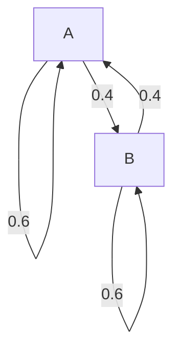

# Eigenvectors & Eigenvalues
If $A \in \mathbb R^{n \times n}$, and there is a $\vec v \neq \vec0$ in $\mathbb R^n$ and

$$
A\vec v = \lambda \vec v
$$

Then $\vec v$ is an eigenvector for $A$ and $\lambda \in \mathbb C$ is the corresponding eigenvalue.

* Direction $\vec v$ is fixed by $A$.

- We will only consider square matrices
- If $\lambda \in \mathbb R$ then
    - When $\lambda > 0$, $A\vec v$ and $\vec v$ point in the same direction
    - When $\lambda < 0$, $A\vec v$ and $\vec v$ point in the opposite direction
- Even when all entries of $A$ and $\vec v$ are real, $\lambda$ can be complex.

## Example 1
Which of the following are eigenvectors of $A = \begin{bmatrix} 1 & 1 \\ 1 & 1 \end{bmatrix}$? What are the correspoonding eigenvalues?

### 1. $\vec v_1 = \begin{bmatrix} 1 \\ 1 \end{bmatrix}$
**Solution:**

$$
A\vec v_1 = \begin{bmatrix} 2 \\ 2 \end{bmatrix} = 2 \begin{bmatrix} 1 \\ 1 \end{bmatrix} \\
\lambda = 2
$$

### 2. $\vec v_2 = \begin{bmatrix} 1 \\ -1 \end{bmatrix}$
**Solution:**

$$
A\vec v_2 = \begin{bmatrix} 0 \\ 0 \end{bmatrix} = 0 \begin{bmatrix} 1 \\ -1 \end{bmatrix} \\
\lambda = 0
$$

OK, because $\lambda$ can be 0.

### 3. $\vec v_3 = \begin{bmatrix} 0 \\ 0 \end{bmatrix}$
**Solution:**

Nope, because eigenvectors cannot be $\vec 0$.

## Example 2
Confirm that $\lambda = 3$ is an eigen value of $A = \begin{bmatrix} 2 & -4 \\ -1 & -1 \end{bmatrix}$.

**Solution:** $\lambda = 3$ means that there is a eigenvector $\vec x$ that can solve:

$$
\begin{aligned}
  A\vec x &= 3 \vec x & (\vec x \neq \vec 0) \\
  A\vec x &= 3I\vec x \\
  (A - 3I)\vec x &= \vec 0 \\
  \begin{bmatrix} 2 & -4 \\ -1 & -1 \end{bmatrix}\vec x &= \vec 0 \\
  \vec x &= x_2 \begin{bmatrix} -4 \\ 1 \end{bmatrix}
\end{aligned}
$$

## Eigenspace
Suppose $A \in \mathbb R^{n \times n}$. The eigenvectors for a given $\lambda$ span a subspace of $R_n$  called the $\lambda$-eigenspace of $A$.

Note that if

$$
A\vec x = \lambda \vec x \\
A\vec y = \lambda \vec y \\
$$

then

$$
A(\vec x + \vec y) = A \vec x + A \vec y = \lambda \vec x + \lambda \vec y = \lambda(\vec x + \vec y)
$$

Also note that the $\lambda$-eigenspace for matrix $A$ is $\text{Null}(A-\lambda I)$.

### Example
Construct a basis for the eigenspace for the matrix whose eigen values are given and sketch eigenvalues.

$$
A = \begin{bmatrix}
  5 & -6 \\
  3 & -4 \\
\end{bmatrix}
$$

#### $\lambda = -1$
**Solution:**

$$
\begin{aligned}
  (A - \lambda I)\vec{x} &= \vec 0 \\
  \begin{bmatrix}
    6 & -6 \\
    3 & -3 \\
  \end{bmatrix}\vec{x} &= \vec 0 \\
  x_1 &= x_2 \\
  \vec x &= \begin{bmatrix} x_1 \\ x_2 \end{bmatrix} \\
  &= \begin{bmatrix} x_2 \\ x_2 \end{bmatrix} \\
  &= x_2 \begin{bmatrix} 1 \\ 1 \end{bmatrix}
\end{aligned}
$$

Thus the basis is $\{\begin{bmatrix} 1 \\ 1 \end{bmatrix}\}$.

#### $\lambda = 2$
**Solution:**

$$
\begin{aligned}
  (A - \lambda I)\vec{x} &= \vec 0 \\
  \begin{bmatrix}
    3 & -6 \\
    3 & -6 \\
  \end{bmatrix}\vec{x} &= \vec 0 \\
  x_1 &= 2x_2 \\
  \vec x &= \begin{bmatrix} x_1 \\ x_2 \end{bmatrix} \\
  &= \begin{bmatrix} 2x_2 \\ x_2 \end{bmatrix} \\
  &= x_2 \begin{bmatrix} 2 \\ 1 \end{bmatrix}
\end{aligned}
$$

Thus the basis is $\{\begin{bmatrix} 2 \\ 1 \end{bmatrix}\}$.

## Theorems
1. The diagonal elements of a triangular matrix are its eigenvalues.
2. $A$ is invertible $\Leftrightarrow$ $0$ is not an eigenvalue of $A$.
3. Stochastic matrices have an eigenvalue equal to $1$.
4. If $\vec v_1, \vec v_2, \dots, \vec v_k$ are eigenvectors that correspond to distinct eigenvalues, then $\vec v_1, \vec v_2, \dots, \vec v_k$ are linearly independent.

## Warning
We can't determine the eigenvalues of a matrix from its reduced form.

Row reductions change the eigenvalues of a matrix.

## Characteristic Polynomial
$\lambda$ is an eigenvalue of $A \Leftrightarrow (A - \lambda I)$ is not invertible.

Therefore, to calculate the eigenvalues of $A$, we can solve

$$
\det(A - \lambda I) = \vec 0
$$

The quantity $\det(A - \lambda I)$ is the **characteristic polynomial** of $A$.

The quantity $\det(A - \lambda I)$ is the **characteristic equation** of $A$.

The roots of the characteristic polynomial are the eigenvalues of $A$.

### Example
Find the characteristic polynomial of $A = \begin{bmatrix} 5 & 2 \\ 2 & 1 \end{bmatrix} is:$. Then find the eigen values.

**Solution:**

Characteristic polynomial:

$$
\det(A - \lambda I) = \det\begin{bmatrix} 5 - \lambda & 2 \\ 2 & 1 - \lambda \end{bmatrix} = (5 - \lambda)(1 - \lambda) - 2 \times 2 = \lambda^2 - 6\lambda + 1
$$

Eigenvalues:

$$
\begin{aligned}
  \lambda^2 - 6\lambda + 1 &= 0 \\
  x & = \frac{6 \pm \sqrt{36 - 4}}2 \\
    & = 3 \pm 2\sqrt2

\end{aligned}
$$

## Characteristic Polynomial of $2 \times 2$ Matrices
Express the characteristic equation of

$$
M = \begin{bmatrix}
  a & b \\
  c & d \\
\end{bmatrix}
$$

in terms of its determinant. What is the equation when $M$ is singular?

$\det(M - \lambda I) = 0$

$(a - \lambda)(d - \lambda) - bc = 0$

If $M$ is singular then $\lambda = 0$ is a eigen value

## Algebric Multiplicity
The algebraic multiplicity of an eigen value is its multiplicity as a root of the characteristic polynomial.

### Example
Compute the algebraic multiplicities of the eigen values for the matrix:

$$
A = \begin{bmatrix}
  1 & 0 & 0 & 0 \\
  0 & 0 & 0 & 0 \\
  0 & 0 & -1 & 0 \\
  0 & 0 & 0 & 0 \\
\end{bmatrix}
$$

**Solution:** We can directly read it off from the main diagonal: $\lambda = -1, 0, 0, 1$

- $\lambda = -1$, multiplicty = 1
- $\lambda = 0$, multiplicity = 2
- $\lambda = 1$, multiplicity = 1

## Geometric Multiplicty
The **geometric mutiplicity** of an eigenvalue $\lambda$ is the dimension of $\text{Null}(A - \lambda I)$.

Geometrix multiplicity is always at least 1. It can be smaller than algebraic multiplicty.

### Example
$$
\begin{bmatrix}
  0 & 1 \\
  0 & 0 \\
\end{bmatrix}
$$

**Solution:**

It is upper triangular, so its eigen values are: $\lambda = 0$ with algebraic multiplicity = 1.

Then, we compute $\text{Null}(A - \lambda I)$, which, since $\lambda = 0$, is also:

$$
\begin{bmatrix}
  0 & 1 \\
  0 & 0 \\
\end{bmatrix}
$$

It has one pivotal column so rank = 1, and thus dimension of null space is 2 - 1 = 1.

## Beautiful Facts
- $\det A = \lambda_1 \lambda_2 \dots \lambda_n$
- $\text{trace }A = \text{sum of diagonal elements} = \lambda_1 + \lambda_2 + \dots + \lambda_n$

## Long Term Behavior of Markov Chains
We often want to know what happens to a Markov Chain $\vec x_{k+1} = P\vec x_k, k = 0, 1, 2, \dots$, then there is a unique steady state $\vec x_\infty$ that $P\vec x_\infty = \vec x_\infty$ ($\lambda = 1$).

Also note that all other $\lambda$ satisfy $|\lambda| < 1$.

Thus algebraic multiplicty for $\lambda = 1$ is 1.

### Example
Given the Markov Chain:

$$
\vec x_{k+1} = \begin{bmatrix}
  .6 & .4 \\
  .4 & .6 \\
\end{bmatrix} \vec x_k, \vec x_0 = \begin{bmatrix}
  1 \\ 0
\end{bmatrix}
$$

Which can be also represented as:

Use eigenvalues to describe the long-term behavior of the system.

**Solution:**

First, we need to find the eigenvalues. Since it is regular, we know that one of the eigenvalues is 1. Eventhough we can solve it with a characteristic polynomial, we know that $\text{trace }A = \lambda_1 + \lambda_2$. Trace in this case is $0.6 + 0.6 = 1.2$, thus we know the other eigenvalue is $1.2 - 1 = 0.2$.

Second, we need to find the corresponding eigenvectors of $P$:

For $\lambda = 1$:

$$
\begin{aligned}
  (A - I)\vec x_1 &= \vec0 \\
  \begin{bmatrix}
    -.4 & .4 \\
    .4 & -.4 \\
  \end{bmatrix}\vec x_1 &= \vec0 \\
  \vec x_1 &= \begin{bmatrix}
    1 \\ 1
  \end{bmatrix}
\end{aligned}
$$

For $\lambda = .2$:

$$
\begin{aligned}
  (A - .2I)\vec x_2 &= \vec0 \\
  \begin{bmatrix}
    .4 & .4 \\
    .4 & .4 \\
  \end{bmatrix}\vec x_2 &= \vec0 \\
  \vec x_2 &= \begin{bmatrix}
    1 \\ -1
  \end{bmatrix}
\end{aligned}
$$

Third, we write the initial condition as a linear combination of the basis of the eigenvector.

$$
  c_1\vec x_1 + c_2\vec x_2
= \begin{bmatrix}
    1 & 1 \\
    1 & -1 \\
  \end{bmatrix}\vec c
= \begin{bmatrix} 1 \\ 0 \end{bmatrix} \\
\vec c = \begin{bmatrix} \frac12 \\ \frac12 \end{bmatrix}
$$

Then we can rewrite $q_k$:

$$
q_k = P^k\vec q_0 = c_1P^k\vec x_1 + c_2P^k\vec x_2 = c_1\vec x_1 + c_2(0.2)^k\vec x_2 = \begin{bmatrix} \frac12 \\ \frac12 \end{bmatrix} + (0.2)^k\begin{bmatrix} \frac12 \\ -\frac12 \end{bmatrix}
$$

## Similar Matrices
Two $n \times n$ matrices $A$ and $B$ are **similar** if there is a matrix $P$ so that $A = PBP^{-1}$,

If $A$ and $B$ are similar, then they have the same characteristic polynomial.

## Additional Examples
### True or false: If $A$ is similar to the identity matrix, then $A$ is equal to the identity matrix.
**Solution:** True, $A = PIP^{-1} = I$

### True or false: A row replacement operation on a matrix does not change its eigenvalues.
**Solution:** False

### For what value of $k$ does the matrix have one real eigenvalue with algebraic multiplicty 2?
$$
A = \begin{bmatrix}
  -3 & k \\
  2 & -6 \\
\end{bmatrix}
$$

$$
\det(A - \lambda I) = (3 + \lambda)(6 + \lambda) - 2k
= \lambda^2 + 9 \lambda + 18 - 2k
$$

This should be a square, meaning $\Delta$ needs to be 0.

$$
\Delta = b^2 - 4ac = 81 - 4(18 - 2k) = 0
$$

$$
\Delta = -\frac98
$$