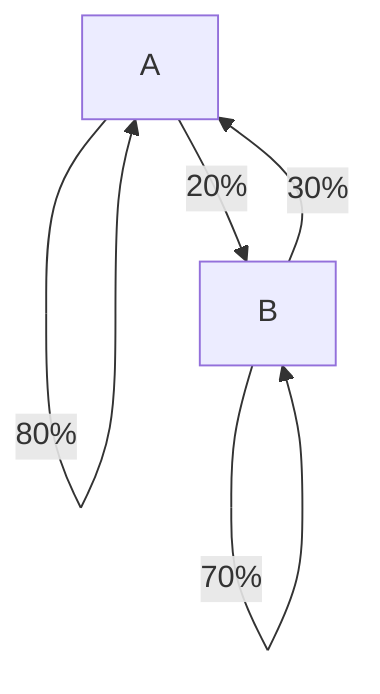
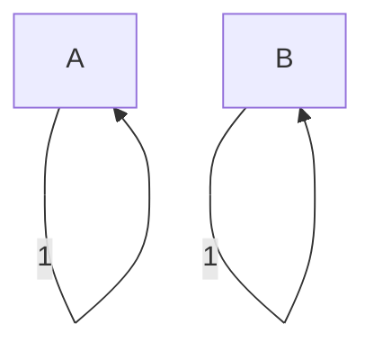
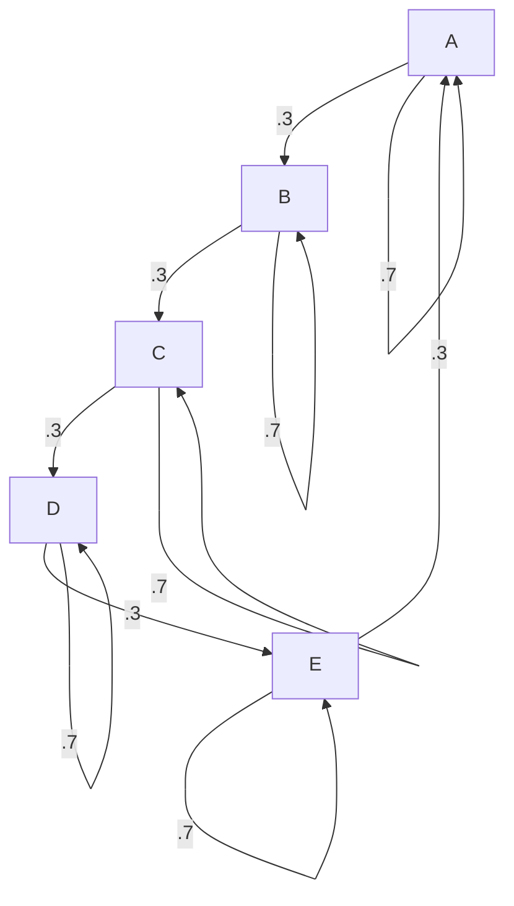
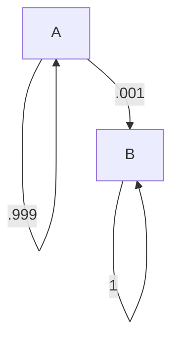
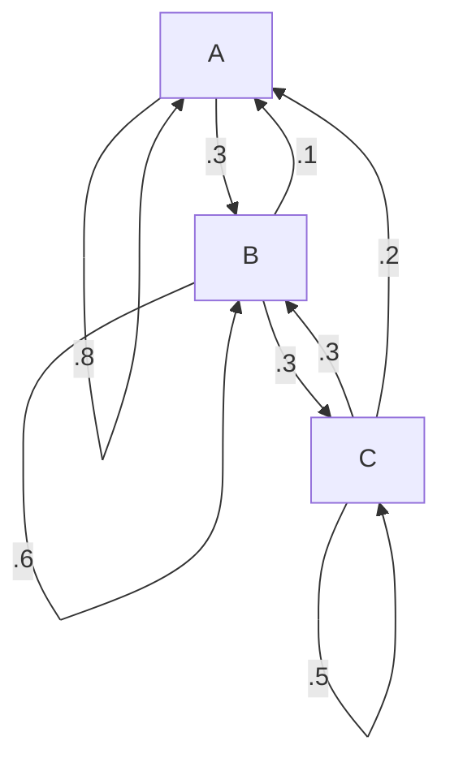

# 4.9 Markov Chains
Lectured on 9/30/2019

## Example
If there are two libraries, A and B. After 1 month, books of A,

- 80% goes to A
- 20% goes to B

Similarly, after 1 month, books of B,

- 30% goes to A
- 70% goes to B

If each library have 1000 books, how many books does each have after 1 month, 1 year, $k$ month?

**Solution:**

We first look at what will happened if all the books are in A:

$$
\begin{bmatrix}
  1 \\ 0
\end{bmatrix} \to \begin{bmatrix}
  .8 \\ .2
\end{bmatrix} = \text{first column of the transform matrix}
$$

Then we look what will happen if all the books are in B:

$$
\begin{bmatrix}
  0 \\ 1
\end{bmatrix} \to \begin{bmatrix}
  .3 \\ .7
\end{bmatrix} = \text{second column of the transform matrix}
$$

Combine those two columns:

$$
\begin{bmatrix}
  .8 & .3 \\
  .2 & .7 \\
\end{bmatrix}
$$

Then we look at the initial condition and see what happens after applying the transformation.

$$
\vec{x_0} = \begin{bmatrix} .5 \\ .5 \end{bmatrix} \\
\vec{x_1} = \begin{bmatrix}
  .8 & .3 \\
  .2 & .7 \\
\end{bmatrix}\begin{bmatrix} .5 \\ .5 \end{bmatrix} = \begin{bmatrix}
  .55 \\ .45
\end{bmatrix}
$$

After $k$ month:

$$
\begin{bmatrix}
  .8 & .3 \\
  .2 & .7 \\
\end{bmatrix}^k \begin{bmatrix}
  .5 \\ .5
\end{bmatrix}
$$

## Definitions
- **Probability Vector** - Vector $\vec{x}$ with non-negative elements that sum to 1.
- **Stochastic Matrix** - A square matrix $P$ whose columns are probability vectors.
- **Markov Chain** - A sequence of probability $\vec{x_k}$ and a stochastic matrix $P$ such that $\vec{x_{k+1}} = P\vec{x_k},\ k = 0, 1, 2, \dots$.
- **Steady-state Vector** for $P$ - A probability vector $\vec{q}$ such that $P\vec{q} = \vec{q}$.

### Example
Determine a steady-state vector for the stochastic matrix $P = \begin{bmatrix} .8 & .3 \\ .2 & .7 \end{bmatrix}$.

**Solution:**

$$
\begin{aligned}
  P\vec{x} &= \vec{x} \\
  P\vec{x} &= I\vec{x} \\
  (P - I)\vec{x} &= \vec{0} \\
  \left(\begin{bmatrix}
    .8 & .3 \\
    .2 & .7 \\
  \end{bmatrix} - \begin{bmatrix}
    1 & 0 \\
    0 & 1 \\
  \end{bmatrix}\right)\vec{x} &= \vec{0} \\
  \begin{bmatrix}
    -.2 & .3 \\
    .2 & -.3 \\
  \end{bmatrix}\vec{x} &= \vec{0} \\
\end{aligned}
$$

We notice that the two columns are linearly dependent, which is expected. Now we need to find any non-zero vector solution:

$$
\vec{x} = \begin{bmatrix} 3 \\ 2 \end{bmatrix}
$$

Which gives us the probability vector:

$$
\vec{q} = \begin{bmatrix} \frac{3}{5} \\ \frac{2}{5} \end{bmatrix}
$$

## Convergence
A stochastic matrix $P$ is regular if there is some $k$ such that $P^k$ only contains strictly positive entries.

If $P$ is a regular stochastic matrix, then $P$ has a unique steady state vector $\vec{q}$, and $\vec{x_{k+1}} = P\vec{x_k}$ converges to $\vec{q}$ as $k \to \infty$.

Nonregular: for all $k \in N$, $P^h$ has some entry = 0.

If there are more than one steady-state vector or no steadt-state vector -> Not regular

### Examples
Non-Regular:

---

Regular and $P$ has many zeros:

---

Not regulat but has a unique steady state:

### Example

Find steady-state vector $q$.

**Solution:**

1. Find any vectors in null of $(P - I)$

$$
\begin{aligned}
  P &= \begin{bmatrix}
    .8 & .1 & .2 \\
    .2 & .6 & .3 \\
     0 & .3 & .5 \\
  \end{bmatrix} \\
  P - I & = \begin{bmatrix}
    -.2 & .1 & .2 \\
    .2 & -.4 & .3 \\
     0 & .3 & -.5 \\
  \end{bmatrix} \\
  \begin{bmatrix}
    -.2 & .1 & .2 \\
    .2 & -.4 & .3 \\
     0 & .3 & -.5 \\
  \end{bmatrix} \vec{x} &= \vec{0} \\
  \begin{bmatrix}
    -2 & 1 & 2 \\
    2 & -4 & 3 \\
    0 & 3 & -5 \\
  \end{bmatrix} \vec{x} &= \vec{0}
\end{aligned}
$$

Using the last row, we can guess that $x_2 = 5$ and $x_3 = 3$. Plug in to the first row, we get $x_1 = \frac{11}{2}$. Convert to probability vector: $\vec{q} = \begin{bmatrix} \frac{11}{27} \\ \frac{10}{27} \\ \frac{6}{27} \end{bmatrix}$.
