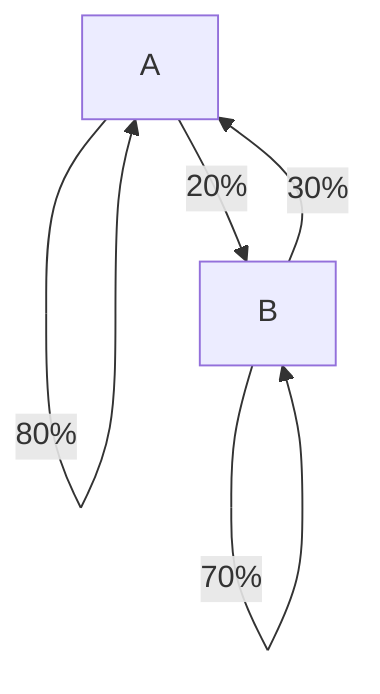

# 4.9 Markov Chains
Lectured on 9/30/2019

## Example
If there are two libraries, A and B. After 1 month, books of A,

- 80% goes to A
- 20% goes to B

Similarly, after 1 month, books of B,

- 30% goes to A
- 70% goes to B

If each library have 1000 books, how many books does each have after 1 month, 1 year, n month?

**Solution:**

We first look at what will happened if all the books are in A:

$$
\begin{bmatrix}
  1 \\ 0
\end{bmatrix} \to \begin{bmatrix}
  .8 \\ .2
\end{bmatrix} = \text{first column of the transform matrix}
$$

Then we look what will happen if all the books are in B:

$$
\begin{bmatrix}
  0 \\ 1
\end{bmatrix} \to \begin{bmatrix}
  .3 \\ .7
\end{bmatrix} = \text{second column of the transform matrix}
$$

Combine those two columns:

$$
\begin{bmatrix}
  .8 & .3 \\
  .2 & .7 \\
\end{bmatrix}
$$

Then we look at the initial condition and see what happens after applying the transformation.

$$
\vec{x_0} = \begin{bmatrix} .5 \\ .5 \end{bmatrix} \\
\vec{x_1} = \begin{bmatrix}
  .8 & .3 \\
  .2 & .7 \\
\end{bmatrix}\begin{bmatrix} .5 \\ .5 \end{bmatrix} = \begin{bmatrix}
  .55 \\ .45
\end{bmatrix}
$$